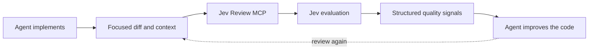

# Jev Review

<div align="center">

**Continuous software-quality review for AI coding agents, powered by [Jev](https://typesafe.ai/).**

[](LICENSE)


[Quick start](#quick-start) · [Client setup](#client-setup) · [Quality dimensions](#quality-dimensions) · [Security](#security-and-privacy)

</div>

Jev Review runs as a local MCP server and gives Claude Code, Codex, Cursor, and OpenCode structured quality scores while they work. Your coding agent remains responsible for diagnosing weaknesses and changing the code; Jev supplies a fast scalar signal across correctness, complexity, changeability, modularity, tests, security, and other independent quality dimensions.

> [!NOTE]
> This is a fork of [NiazMorshed2007/jev-review](https://github.com/NiazMorshed2007/jev-review). It adds OpenRouter as an alternative Jev provider and runs the MCP server and development workflow with Bun. Direct TypeSafe access remains the default.

> [!IMPORTANT]
> **Your API key stays on your machine.** Jev Review has no hosted backend, database, telemetry service, or author-operated proxy. The only remote request is sent directly to the configured Jev API.

## Demo

<p align="center">
  

https://github.com/user-attachments/assets/0ff9f873-0652-4826-af3d-6bb4f42c70b1


</p>

## At a glance

| | |
| --- | --- |
| **Purpose** | Continuous, structured software-quality evaluation |
| **Supported clients** | Claude Code, Codex, Cursor, OpenCode |
| **Distribution** | This GitHub repository—no npm publication |
| **Runtime** | Local Bun process over MCP stdio |
| **Remote access** | TypeSafe or OpenRouter Decisions API using your provider key |
| **MCP tools** | `jev_review` for iterative quality scores; `jev_signal` for a one-off file judgment |
| **Code changes** | Always performed by the primary coding agent |

## Quick start

Requirements:

- Bun 1.4 or newer
- A Jev API key from the [TypeSafe console](https://console.typesafe.ai/) or an [OpenRouter API key](https://openrouter.ai/keys)
- Claude Code, Codex, Cursor, or OpenCode

For Codex, the shortest install is the [Agent Plugins CLI](https://www.npmjs.com/package/plugins), run with Bun:

```bash
bun x --bun plugins add Eriyc/jev-review --target codex
```

Choose the user scope when prompted. Bun and a provider key are still required. The installer uses the committed server bundle, so no build is needed. Set `JEV_PROVIDER=openrouter` and `OPENROUTER_API_KEY` in the MCP environment as shown under [Codex setup](#codex). The same command supports `--target claude-code` or `--target cursor`.

To install manually or develop the fork, clone, install dependencies, and build with Bun:

```bash
git clone https://github.com/Eriyc/jev-review.git
cd jev-review
bun install --frozen-lockfile
bun run build
```

Set a provider key before starting your coding agent. TypeSafe remains the default:

```bash
export JEV_API_KEY="your-typesafe-key"
```

For OpenRouter, set `JEV_PROVIDER=openrouter` and `OPENROUTER_API_KEY` instead. `JEV_MODEL` is optional: OpenRouter defaults to `~typesafe/jev-latest`, and you can pin `typesafe/jev-1.13`. Direct TypeSafe defaults to `jev-latest`.

```text
Direct:     Codex → local Bun MCP → TypeSafe
OpenRouter: Codex → local Bun MCP → OpenRouter → Jev provider
```

## How it works



Jev Review is intended for frequent, focused checkpoints: after a coherent implementation slice, after a score-driven improvement, and before final handoff. The first call establishes a baseline. The agent then inspects its own implementation, forms a hypothesis about weak dimensions, improves the code, validates it, and rescores.

Jev returns typed Score, Choice, and Noul decisions rather than a free-form review essay. It does not generate a prose explanation of why a score is low. Jev Review validates and converts those decisions into metric scores, confidence levels, coarse rubric hints, and comparisons with a previous evaluation. The coding agent—not Jev—must determine the actual cause and appropriate code change.

There is deliberately no synthetic “82/100” overall score. Dimension changes such as `Readability 6.3 → 8.1` and `Security 8.2 → 8.2` are more useful than a blended percentage.

## Client setup

All clients launch the committed `dist/server.js` bundle with Bun over stdio. Use an absolute path to your local clone. Keep API keys in your environment or a local, uncommitted client configuration.

### Codex

Direct TypeSafe, using an inherited environment variable in `~/.codex/config.toml`:

```toml
[mcp_servers.jev-review]
command = "bun"
args = ["/absolute/path/to/jev-review/dist/server.js"]
env_vars = ["JEV_API_KEY"]
```

OpenRouter, using an inherited key and explicit provider selection:

```toml
[mcp_servers.jev-review]
command = "bun"
args = ["/absolute/path/to/jev-review/dist/server.js"]
env_vars = ["OPENROUTER_API_KEY"]

[mcp_servers.jev-review.env]
JEV_PROVIDER = "openrouter"
JEV_MODEL = "~typesafe/jev-latest"
```

Set `JEV_MODEL = "typesafe/jev-1.13"` to pin the current Jev version. If Codex does not pass through user variables, set `OPENROUTER_API_KEY` in the local `[mcp_servers.jev-review.env]` table instead; do not commit that configuration. Restart Codex after editing the MCP configuration.

### Claude Code

For direct TypeSafe:

```bash
claude mcp add --scope user jev-review -- bun /absolute/path/to/jev-review/dist/server.js
```

For OpenRouter, export `JEV_PROVIDER=openrouter` and `OPENROUTER_API_KEY` into Claude Code's environment before starting it. The same Bun command starts the server. The included `.mcp.json` uses Bun when loading this repository as a Claude plugin.

### Cursor

Manual setup in `~/.cursor/mcp.json`:

```json
{
  "mcpServers": {
    "jev-review": {
      "type": "stdio",
      "command": "bun",
      "args": ["/absolute/path/to/jev-review/dist/server.js"],
      "env": {
        "JEV_PROVIDER": "openrouter",
        "OPENROUTER_API_KEY": "${env:OPENROUTER_API_KEY}"
      }
    }
  }
}
```

For direct TypeSafe, remove `JEV_PROVIDER` and pass `JEV_API_KEY` instead. If Cursor is launched from the macOS Dock, make exported variables available to GUI applications with `launchctl setenv` before starting Cursor.

### OpenCode

Point OpenCode at the same Bun bundle in `~/.config/opencode/opencode.json`:

```json
{
  "$schema": "https://opencode.ai/config.json",
  "skills": ["/absolute/path/to/jev-review/skills"],
  "mcp": {
    "servers": {
      "jev-review": {
        "type": "local",
        "command": ["bun", "/absolute/path/to/jev-review/dist/server.js"],
        "environment": {
          "JEV_PROVIDER": "openrouter",
          "OPENROUTER_API_KEY": "{env:OPENROUTER_API_KEY}"
        }
      }
    }
  }
}
```

For direct TypeSafe, remove `JEV_PROVIDER` and pass `JEV_API_KEY` instead. Run `opencode mcp list` to verify the connection.
## MCP tools

Jev Review exposes two tools. `jev_review` remains the iterative software-quality scorer:

```ts
{
  task?: string;
  diff?: string;
  files?: Array<{
    path: string;
    content: string;
  }>;
  repositoryContext?: string;
  previousEvaluation?: Evaluation;
}
```

At least one current-context field is required. Callers should normally send the task and focused diff, adding complete files only when the surrounding implementation is necessary to understand the change. Jev Review never reads the repository automatically.

Jev Review does not impose an additional character, token, or file-count limit. The Jev API currently enforces its own token ceiling: live `jev-latest` behavior indicates roughly 32,768 tokens for the submitted state, although this number is not published in the API documentation or OpenAPI schema and may change. When Jev returns `max_tokens_exceeded`, the server asks the agent to reduce unrelated context or split the change into coherent review slices.

The response contains:

- An independent 1–10 score and 0–1 confidence for each applicable metric
- `{ "applicable": false }` for dimensions unsupported by the supplied context
- Prioritized weak dimensions and coarse predefined rubric hints—not generated root-cause explanations
- Per-metric deltas, improvements, regressions, and unresolved weaknesses when `previousEvaluation` is supplied

### One-off file signal

Use `jev_signal` for a specific yes/no judgment about a file. The agent supplies the file content; the MCP server does not read repository files. Send a complete file when its whole structure matters and it fits the Jev context window. Include relevant rules or neighboring context when the file alone cannot support the judgment.

```json
{
  "file": { "path": "src/service.ts", "content": "<complete file content>" },
  "question": "Does this file combine responsibilities that should change independently?",
  "yesMeans": "The file combines distinct responsibilities with a useful split boundary.",
  "noMeans": "The responsibilities are cohesive; splitting would add fragmentation.",
  "context": "The router owns HTTP handling; repository rules favor domain logic in services."
}
```

The response has `path`, `model`, `evidenceProbability`, and `probabilityYes`. `probabilityYes` is Jev's probability of yes, **not** a confidence score or an automatic pass/fail decision. When Jev finds the supplied evidence insufficient (`evidenceProbability < 0.5`), `probabilityYes` is `null`; provide more context before acting. For file-by-file use, the agent calls `jev_signal` once per relevant file. Exclude secrets, generated files, and vendored code. Enforce mechanical repository rules with tests or linters; use Jev for semantic judgments.

## Quality dimensions

Always evaluated when the supplied context is sufficient:

- Correctness and requirement fit
- Cognitive complexity
- Readability and intent
- Modularity and cohesion
- Coupling and dependency quality
- Changeability and change amplification
- Abstraction and API design
- Project and file structure
- Duplication and reuse
- Maintainability
- Testability and test quality
- Reliability and error handling
- Security
- Consistency and conventions
- Documentation and explainability

Evaluated only when relevant evidence is present:

- Performance and resource efficiency
- Scalability and flexibility
- Compatibility and API stability
- Observability and operability

The evaluator judges consequences in context. It does not assume short functions, small files, zero duplication, more layers, more comments, or more tests are automatically better.

## Evaluation workflow

The included `jev-review` skill teaches agents to treat Jev as a repeated scalar feedback loop:

1. Understand the task and inspect the repository.
2. Implement a coherent change and run relevant checks.
3. Call `jev_review` with focused context to establish a baseline.
4. Inspect the code themselves and form a hypothesis for weak important scores.
5. Make the smallest justified improvement and validate it.
6. Rescore with `previousEvaluation`, then inspect improvements and regressions.
7. Repeat while another evidence-based improvement remains.
8. Stop when requirements and checks pass and further score-seeking would add little real value.

Correctness and the user's requirements always outrank score improvement. A higher score never justifies speculative architecture, unnecessary abstraction, scope expansion, breaking behavior, meaningless tests, or needless rewrites.

## Architecture

```text
jev-review/
├── plugin.json                  # Portable Agent Plugin manifest
├── mcp.json                     # Portable stdio MCP definition
├── .claude-plugin/
│   └── plugin.json              # Claude Code adapter
├── .codex-plugin/
│   └── plugin.json              # Codex metadata
├── skills/
│   └── jev-review/
│       └── SKILL.md             # Agent review workflow
├── src/
│   ├── config/                  # Environment handling
│   ├── evaluation/              # Metrics, scoring, and comparisons
│   ├── jev/                     # Direct Jev client and validation
│   └── mcp/                     # MCP tool boundary
├── dist/
│   └── server.js                # Committed standalone server bundle
├── public/
│   └── jev-review-demo.mp4      # Product demonstration
└── test/                        # Unit and MCP protocol tests
```

`plugin.json` and `mcp.json` are the portable [Agent Plugins 1.0](https://agent-plugins.org/specification) package. `.claude-plugin/plugin.json` and `.mcp.json` provide Claude Code compatibility, while `.codex-plugin/plugin.json` supplies Codex metadata. These are small packaging adapters around one MCP implementation.

## Development

```bash
git clone https://github.com/Eriyc/jev-review.git
cd jev-review
bun install --frozen-lockfile
bun run validate
```

Useful commands:

```bash
bun run check
bun test
bun run build
claude plugin validate . --strict
```

`bun run build` creates the committed `dist/server.js` bundle. The validation script checks types, builds the bundle, then runs Bun tests. Unit and MCP protocol tests use local fakes and do not consume Jev API quota; a live Jev call requires the selected provider's key. Node.js and npm are not required for this workflow.

## Security and privacy

The local MCP process reads `JEV_API_KEY` for direct TypeSafe or `OPENROUTER_API_KEY` for OpenRouter and uses it only in the TLS Authorization header sent to the selected provider. Jev Review never stores or logs the key.

Only context explicitly supplied to `jev_review` or `jev_signal` is sent to Jev. `previousEvaluation` is compared locally and is not included in the current code context. No repository files are discovered or uploaded automatically.

Review context leaves your machine for TypeSafe's Jev API or OpenRouter's Decisions API, depending on configuration. Do not supply secrets or unrelated proprietary content, and review the selected provider's privacy terms. Jev Review complements rather than replaces dedicated security tooling.

## License

[MIT](LICENSE)
